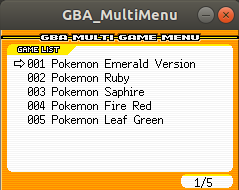
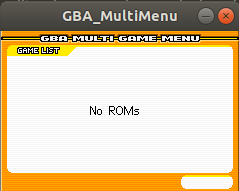

# SDL_GBA_MultiMenu
From SDL1.2 remake implementation by https://github.com/lesserkuma/GBA_MultiMenu

The resolution is 240x160 and can be run on Linux handheld consoles (such as Retromini) after cross compilation.

# Preview

